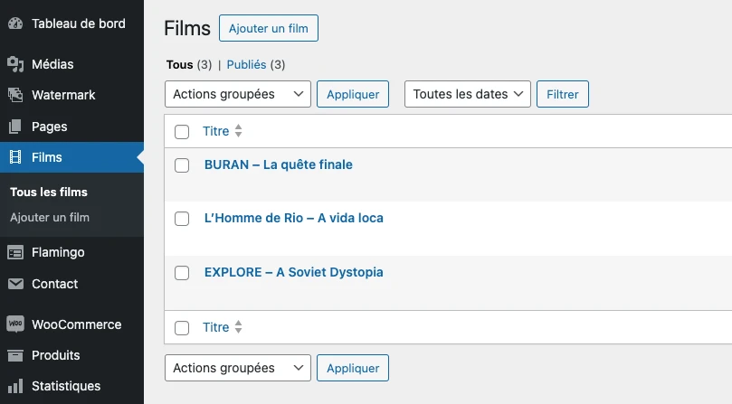
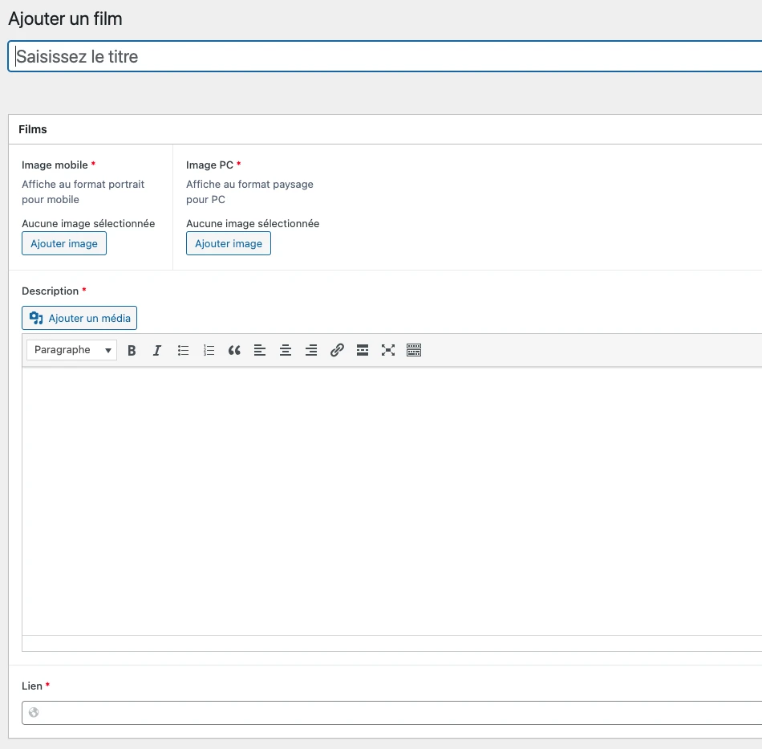

# Les Films

## Ajouter un nouveau film

`Espace administration → Films`

La liste des différents films apparaît. Chaque film est géré comme un post WordPress, au même titre qu’une page ou un produit. On retrouve donc les champs nécessaires à l’édition du contenu. Où on pourra gérer le titre du film, une image différente pour un affichage mobile ou PC, une description, et une lien vers viméo.

Comme pour n’importe quel type de post, le bouton "Publier" permet de sauvegarder les modifications.

## Afficher le film sur la page "Nos films"

`Espace administration → Pages → Nos films`

La page permet directement de récupérer la liste des films ajoutés précédemment, et de les trier à volonté. La liste de droite correspond aux films affichés sur la page, dans l’ordre voulu. Cet ordre peut être modifié par simple glissé-déplacé, et un film peut être ajouté depuis la liste de gauche par un simple clic.

