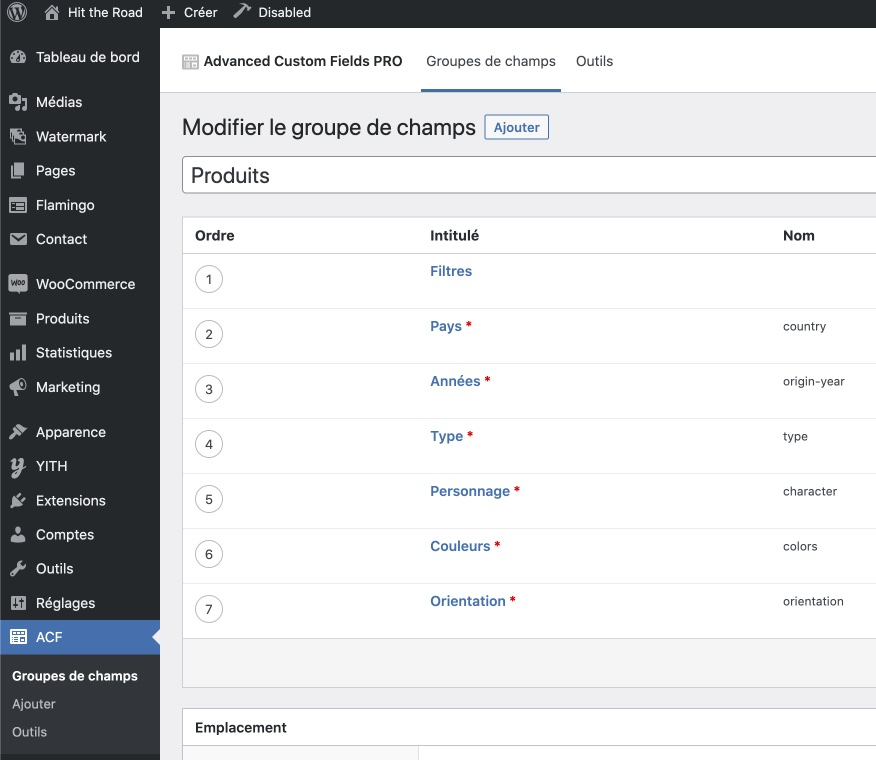
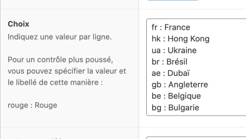

# Les Filtres

## Ajouter un nouveau filtre

`Espace administration → ACF → Produits`



La liste des différents types de filtres est gérée ici. Dans chaque catégorie se trouve une liste de valeurs existantes, qui seront accessibles sur la fiche produit dans l’administration, ainsi que sur le shop dans la liste des filtres.

Il est possible d’ajouter, modifier ou supprimer des valeurs pour chaque type de filtre.

Elles se présentent sous cette forme :

```valeur : Label```



La valeur doit être une chaîne de caractères en minuscules et sans accents ni caractères spéciaux (à l’exception éventuelle d’un tiret). Le label est ce qui sera affichée dans le shop et la page d’administration des produits pour les sélectionner.

Une fois les valeurs ajoutées, cliquer sur le bouton `Modifier` en haut à droite.

> 🚨 **Attention** : les valeurs doivent être uniques.

> 📌 Les valeurs seront affichées sur le site dans le même ordre que leur position dans le champ
