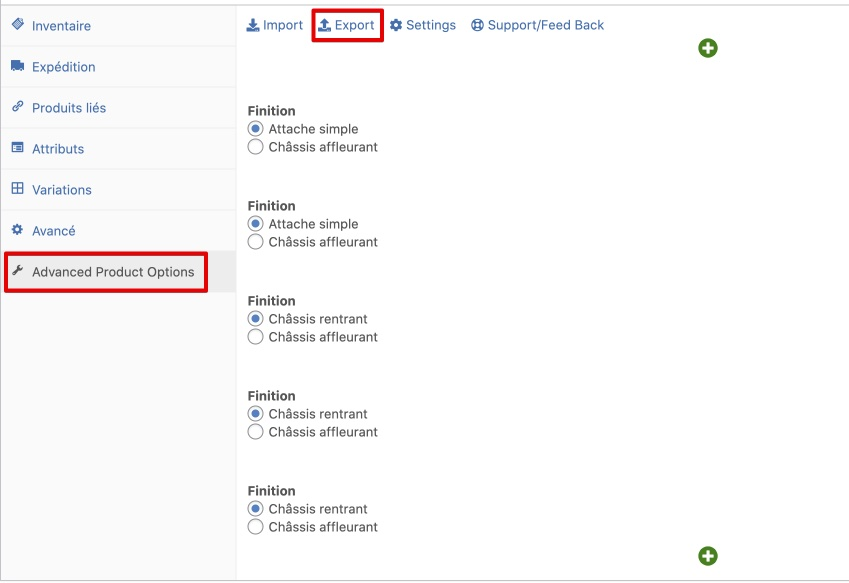

# Options de produits

## Exporter une configuration d’options

`Espace administration → Produits → <Choisir un produit existant> → Advanced Product Options`

Cliquer sur "Export". Un fichier `file.export` sera créé sur le disque. Il peut être utilisé pour être importé sur de nouveaux produits.
