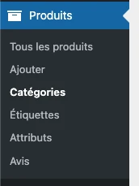
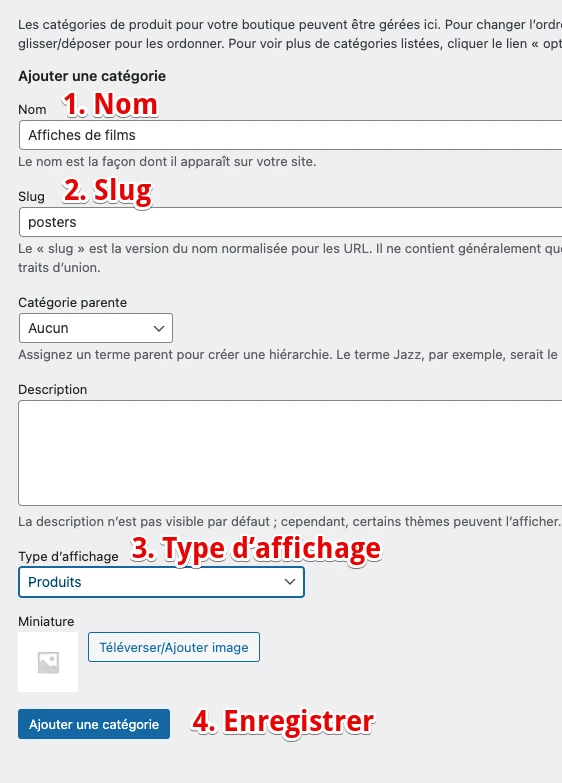
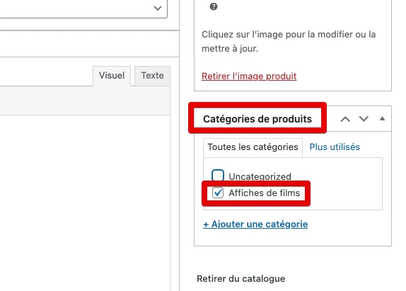
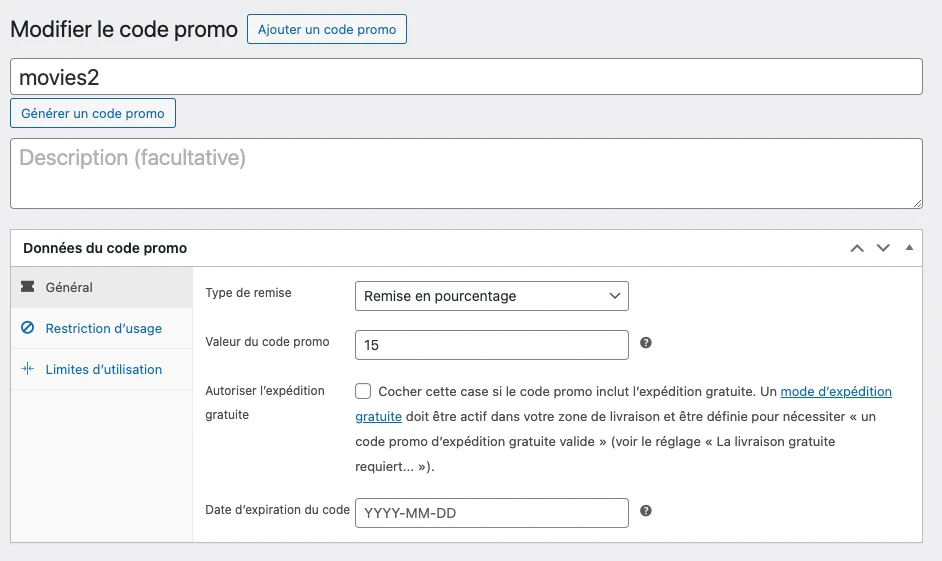
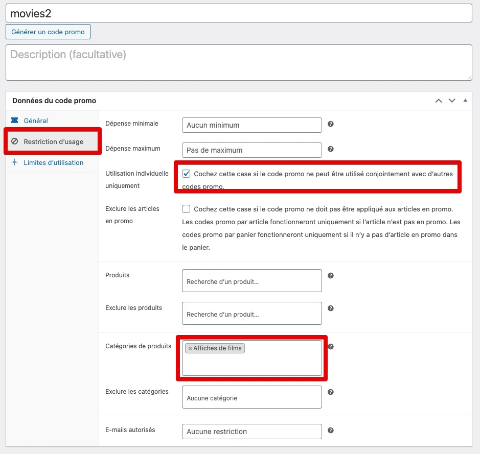
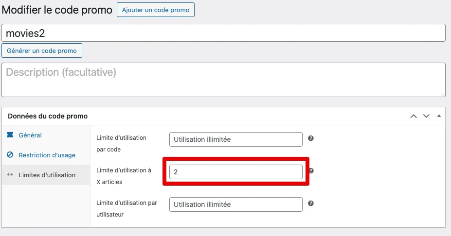
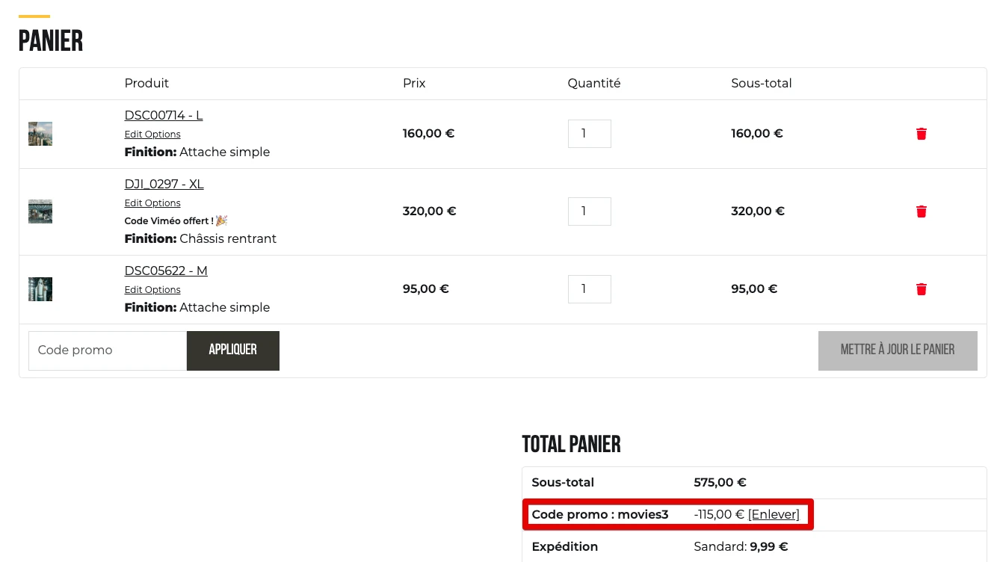

# Packs de produits

## 1. Création de catégorie

Se rendre dans le menu Produits, et cliquer sur le bouton "Catégories" dans le sous-menu.

`Espace administration → Produits → Catégories`

Créer une catégorie spécifique pour le pack souhaité.

1. Choisir un nom
2. Remplir le slug (rempli automatiquement via le nom, mais peut être modifié pour avoir quelque chose de simple)
3. Choisir le type d’affichage "Produits"
4. Enregistrer

## 2. Affecter la catégorie

Sur les produits concernés, se rendre sur la fiche produit et sélectionner la catégorie dans la colonne de droite.

> À noter : Plusieurs catégories peuvent être choisies sur un même produit.

Les produits faisant partie de cette catégorie se verront appliquer les règles du pack (Voir plus bas).

## 2. Créer des codes promos

Créer des codes de promotion spécifiques pour ces packs.

`Espace administration → Marketing → Codes promos`

Cliquer sur "Ajouter un code promo".

Créer un code normalement, avec les spécificités suivantes :

Dans l’onglet "Général", choisir le montant de la réduction souhaité. Ici, 15%.

Dans l’onglet "Restritions d’usage", cocher la case "utilisation individuelle uniquement" afin d’éviter que des codes promos supplémentaires soient utilisés en cumul (sauf si volonté contraire).

Dans le bloc "Catégories de produits", choisir la catégorie souhaitée (précédemment créée). **Cette étape est requise**, la réduction ne s’appliquera pas si la catégorie n’est pas choisie.

Dans l’onglet "Limites d’utilisation", choisir la limite d’utilisation par nombre d’articles. Dans l’exemple, on veut appliquer les 15% si deux produits de la catégorie sont présents dans le panier, on précise donc le nombre "2".

Laisser les deux autres sur "illimité".

> Créer ensuite d’autres codes promos pour 3 produits de la catégorie, et ainsi de suite.

## 4. Résultat

Lorsque les produits du pack sont ajoutés au panier, le code est appliqué automatiquement. Si un autre code promo a déjà été appliqué, il sera automatiquement remplacé.

Si l’un des produits du pack est ajouté, le code promo adéquat sera appliqué (par exemple, movies2 au lieu de movies3 si on retire un des 3 produits du panier).

Les produits du panier qui ne font pas partie de la catégorie liée à la promo ne sont pas comptés dans la promo.

