# Ajouter un nouveau produit

## 1. Création du produit

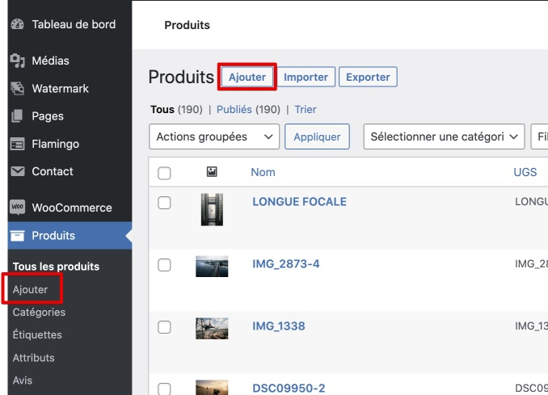

Se rendre dans la rubrique Produits, et cliquer sur le bouton "Ajouter un produit".

`Espace administration → Produits → Ajouter`

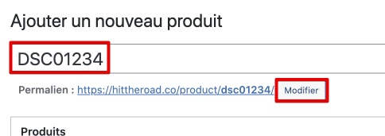

Choisir le nom du produit. Celui-ci doit être identique au nom de la photo correspondante au produit, pour permettre à Pacific Colours de l’identifier (et éventuellement aux acheteurs de le trouver, surtout s’ils reçoivent les photos via Tipee en complément).

Le nom de produit va générer un permalinen qui sera utilisé pour accéder à la page du produit. Si le nom du produit contient des caractères spéciaux, ils seront remplacés automatiquement.

Si jamais le nom du produit doit être changé, le permalien peut être modifié manuellement grâce au bouton "modifier" situé à droite.

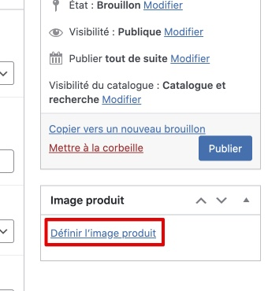

À droite, cliquer sur "Définir l’image produit". Le gestionnaire d’images sera ouvert.

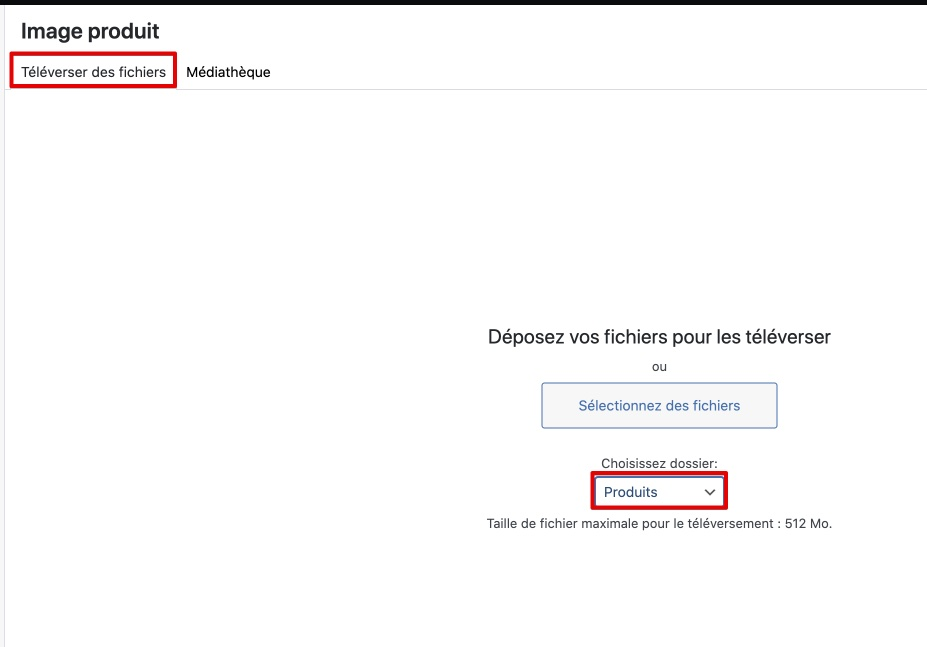

Cliquer sur "Téléverser des fichiers", puis choisir le dossier "Produits" (ce n’est pas obligatoire, MAIS si les images ne sont pas correctement triées, ce sera le bazar dans quelques années pour retrouver quelque chose là-dedans).

Ensuite, cliquer sur "Sélectionnez des fichiers" (ou bien faire directement glisser l’image dans la fenêtre), puis choisir l’image à utiliser.

> 📌 **Rappel :** Les images produit doivent être au format `jpg`, bien compressées (taille inférieure à 1Mo), et doivent être de taille 1920x1200 (ou 1200x1920 si portrait), ou équivalent pour les autres formats.

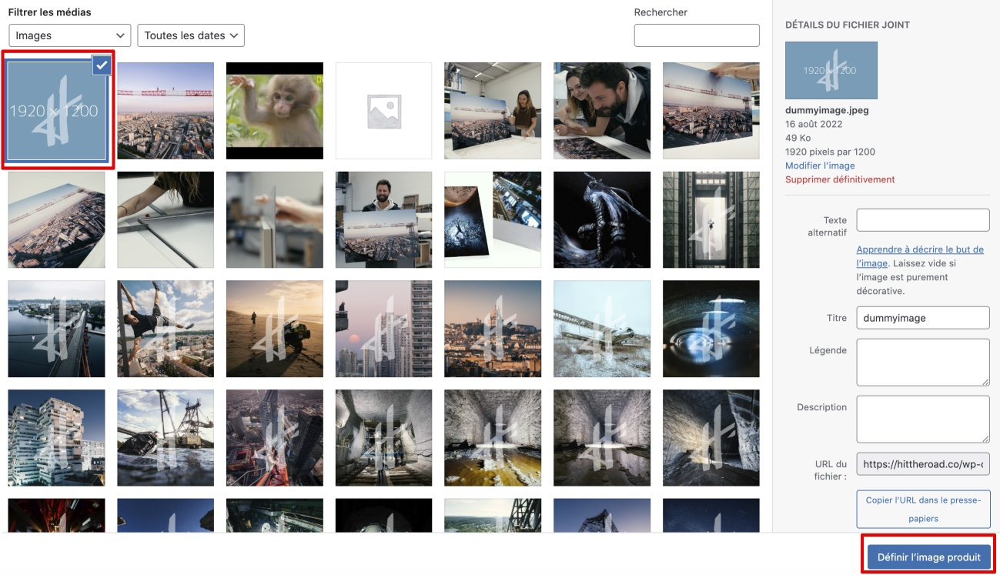

Une fois téléchargée, l’image est automatiquement sélectionnée. On voit que le watermark a été appliqué (il n’apparaîtra pas sur les tailles plus petites).

Cliquer sur "Définir l’image produit".

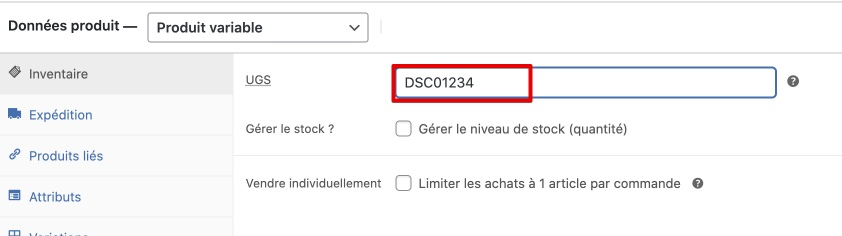

Dans le champ UGS plus bas, remettre le nom du produit, tel quel.

## 2. Renseignement des Filtres

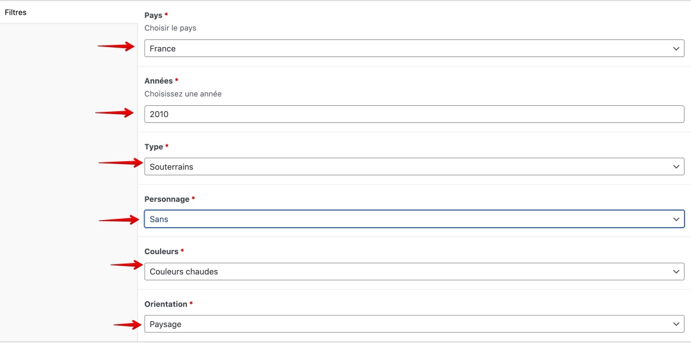

Il est temps de renseigner les filtres. Il suffit de choisir, pour chaque catégorie, le bon item dans la liste.

Ces filtres sont directement liés au tri par filtres sur la boutique, à remplir avec soins donc.

> ↪️ Pour ajouter un nouveau pays à la liste, voir la catégorie "[Ajouter un filtre pays](filtres.md)".

## 3. Créer les déclinaisons de produit

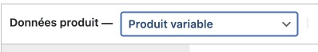

En-dessous des filtres, il faut créer les déclinaisons de produit. Chaque taille (M, L, XL, etc.) est en fait une déclinaison du même produit.

Pour cela, il faut d’dabord définir les données produit sur "Produit variable"

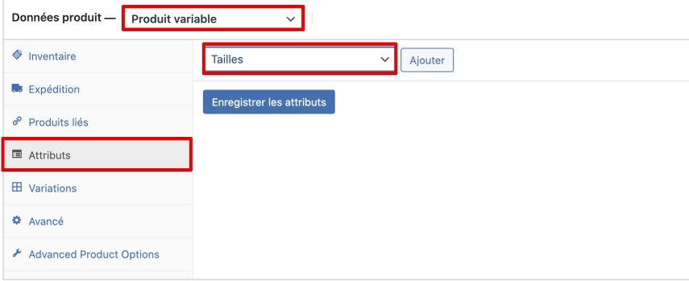

Ensuite, se rendre dans l’onglet `Attributs`. Sélectionner "Tailles" dans la liste des attributs, puis cliquer sur Ajouter.

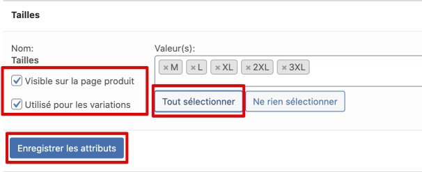

Il faut ensuite choisir les tailles disponibles pour le produit. En cliquant sur "Tout sélectionner", toutes les tailles existantes sont ajoutées.

Bien cocher "Visible sur la page produit" et "Utilisé pour les variations", puis valider avec "Enregistrer les attributs".

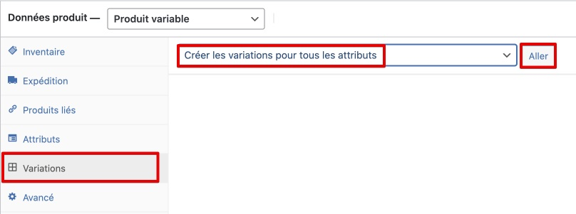

Se rendre dans l’onglet `Variations`, sélectionner "Créer les variations pour tous les attributs", puis valider avec "Aller".

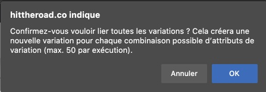

Un message de confirmation apparaît, valider.

Si tout se déroule correctement, les variations apparaissent dans l’ordre de tailles (M, L, XL, etc.).

## 4. Remplir les déclinaisons de produit

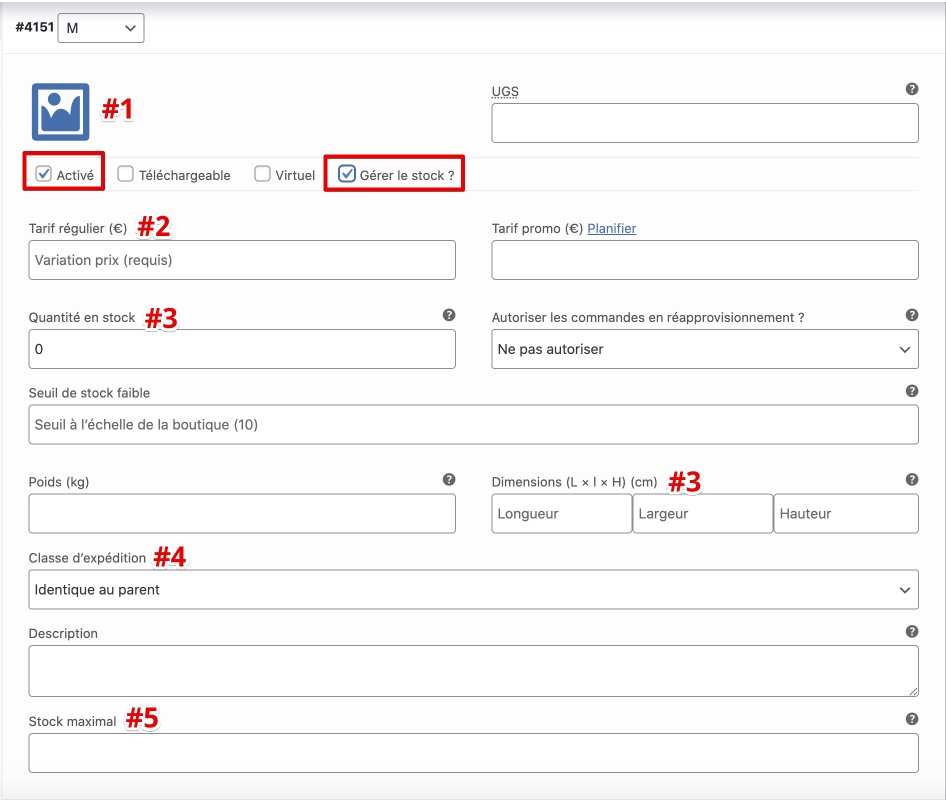

Attention à bien vérifier que les cases "Activé" et "Gérer le stock ?" soient cochées.

Chaque variation doit être remplie avec les informations suivantes :

1. Une image (cliquer sur l’icone pour en choisir une ;reprendre la même déjà transférée)
2. Saisir le prix
3. Saisir la quantité disponible (à savoir, le maximum possible pour la taille en question). Cette quantité sera automatiquement réduite à chaque achat.
4. Saisir les dimensions du produit (Longueur et Largeur uniquement). Attention à inverser le ratio si le produit est en portrait. Ces tailles sont celles affichées sur la page produit.
5. Choisir une classe d’expédition correspondante à la taille (Medium pour le produit M, etc.)
6. Saisir le stock maximal pour la taille. Ceci permet d’afficher la barre de tirages restants sur la page produit. Il doit être identique au champ quantité en stock à la création, mais celui-ci ne sera pas modifié à chaqe achat.

Une fois rempli, la variation doit ressembler à ceci :

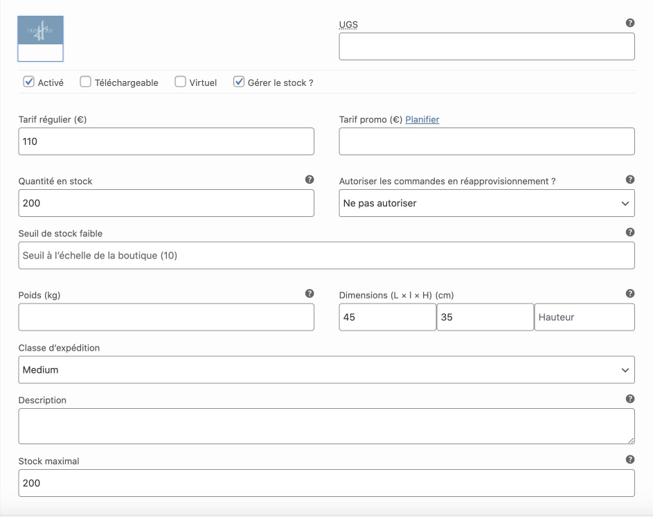

> 🚨 **Important :** Répéter cette étape pour chaque variation (L, XL, etc.), en vérifiant bien que chaque information corresponde bien à la taille en question.

Une fois que toutes les variations ont été correctement saisies, valider avec "Enregistrer les modifications".

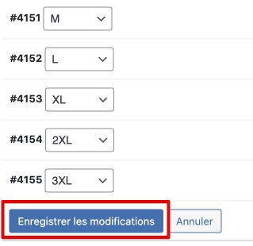

## 5. Gérer les options (châssis)

Se rendre sur l’onglet `Advanced Product Options`.

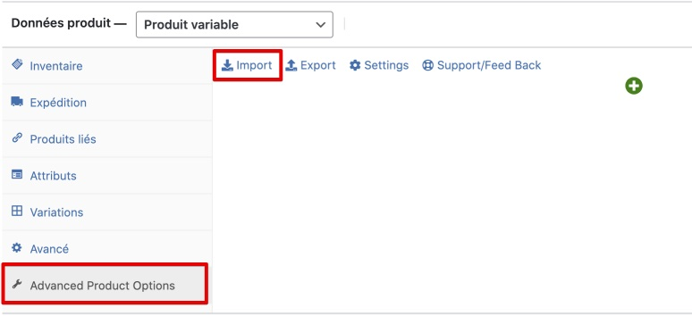

Les options représentent les différents châssis disponibles pour un produit. La configuration est complexe est fastidieuse, mais heureusement il suffit d’importer celle-ci depuis un autre produit.

> ↪️ Si aucun export d’options n’a encore été fait, voir  rubrique "[Exporter des options de produit](options-produit.md)".

Il suffit de cliquer sur "Importer", puis choisir le fichier précédemment exporté.

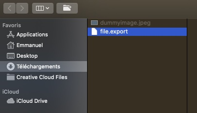

Le résultat doit ressembler à ceci :

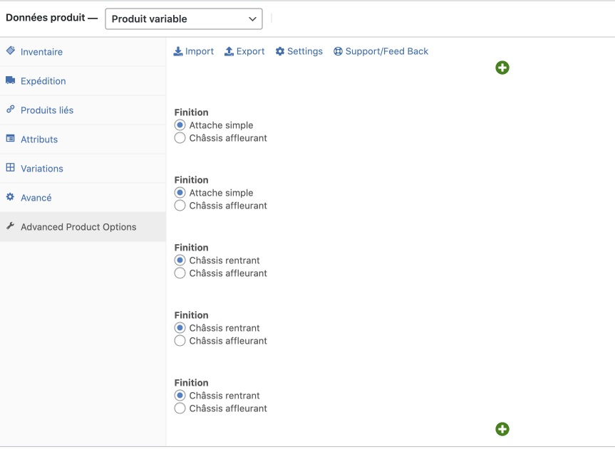

## 6. Publier et vérifier

Il est maintenant temps de publier le produit.

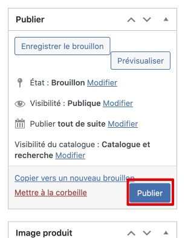

Au préalable, il est plus sûr de l’enregistrer en tant que brouillon d’abord ("Enregistrer le brouillon"), puis de cliquer sur "Prévisualiser". Un nouvel onglet sera alors ouvert avec le produit tel qu'il sera affiché une fois publié.

> 📌 Si on clique sur "prévisualiser" avant d’enregistrer en tant que brouillon, les options (chassis) ne sont pas mises à jour et ne seront pas visibles sur la prévisualisation.

Bien tout vérifier (tailles, prix, disponibilité, dimentions, chassis).

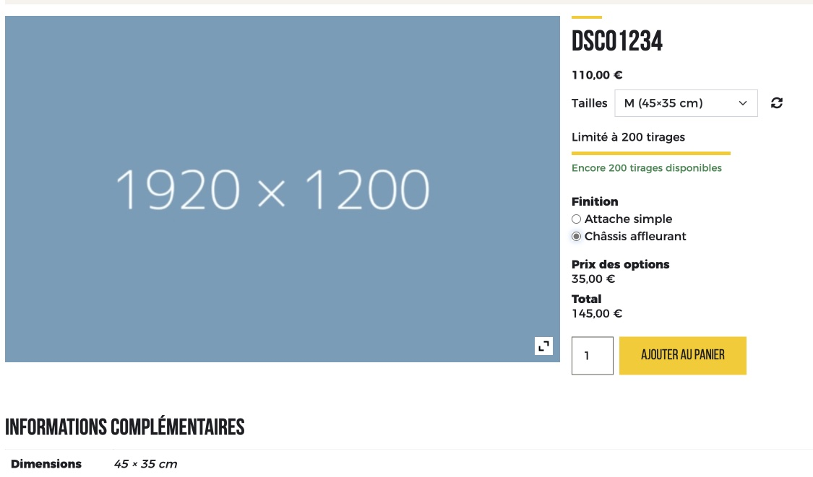

Une fois tout correct, revenir sur l’onglet de l’espace d’administration et cliquer sur "Publier".

> 🎦 [Voir la création de produit en vidéo](pictures/ajout-produit.mp4)
