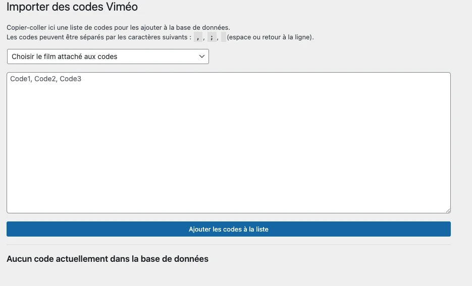
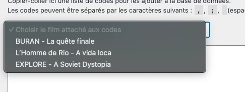
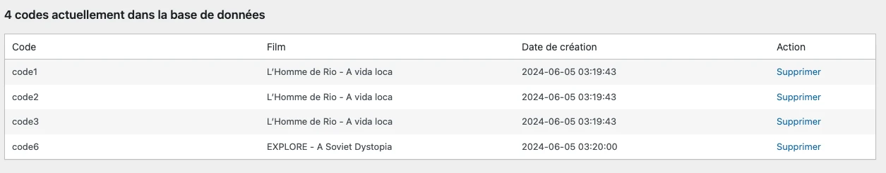
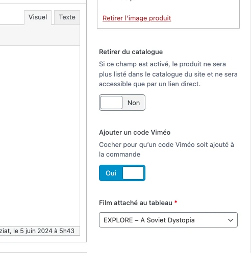
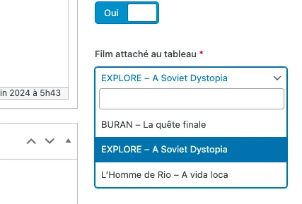

# Codes Vimeo

`Espace administration → Outils → Import de codes Vimeo`



Les codes vimeo doivent être ajoutés en lien avec un [Film](films.md). Ajouter un nouveau film l’ajoutera automatiquement à la liste.



Les codes peuvent être ajoutés par lots pour une même vidéo, sous plusieurs formats. Un espace, une virgule ou un retour à la ligne sera considéré comme un séparateur entre deux codes.

Tous ces exemples sont donc valides :

```
code1, code2, code3, code4
```

```
code1 code2 code3 code4
```

```
code1
code2
code3
code4
````

De cette façon, le copier-coller depuis la génération des codes par Vimeo devrait être plus facile.

Lorsque la liste des codes est ajoutée, le bouton `Ajouter les codes à la liste` les sauvegardera.



Cette liste indique le nombre de codes disponibles.

## Dispenser un code à l’achat d’un produit spécifique

Pour que l’achat d’un produit en particulier envoie un code à l’imprimeur (et à l’imprimeur seulement), il suffit de se rendre sur le [produit](produits.md) en question, puis de trouver à droite l’option "Ajouter un code Viméo".



Cocher la case rend disponible la liste des films, et il suffit alors de choisir le film auquel est lié le produit.



Ainsi lors de la validation du paiement, le premier code lié à ce film sera récupéré, envoyé à l’imprimeur dans les informations de la commande, puis supprimé de la base afin que personne d’autre ne puisse en bénéficier.

> En cas d’absence de code disponible au moment de l’achat, un mail sera envoyé automatiquement à l’adresse d’administration du site, incluant le numéro de commande et le produit, afin de pouvoir prévenir l’imprimeur d’ajouter un code, et de pouvoir en remettre de nouveaux en base.
